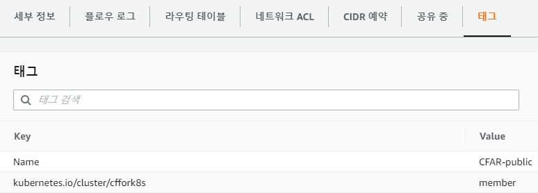
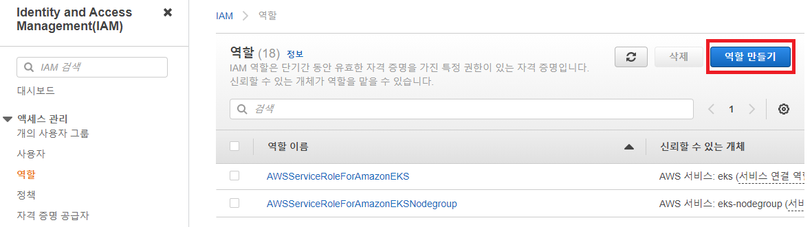
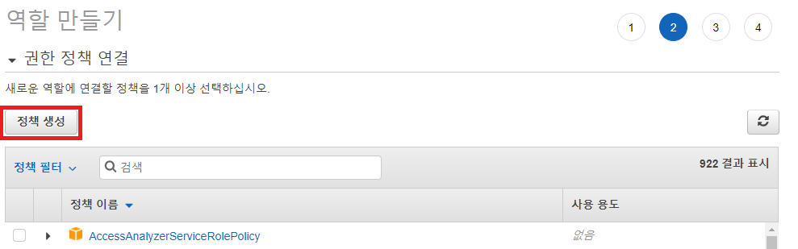
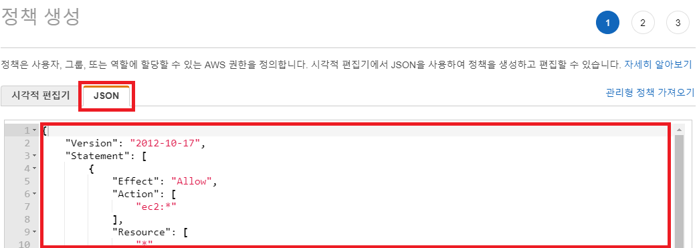
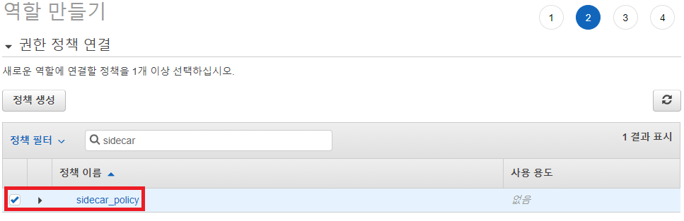
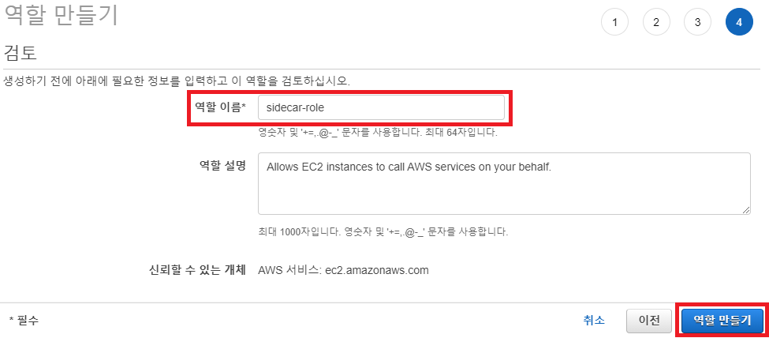
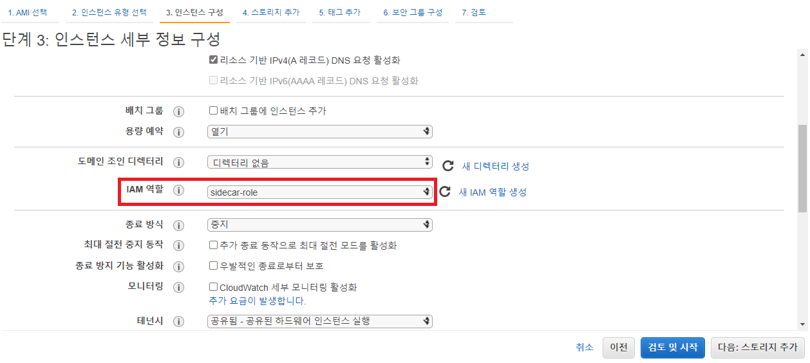
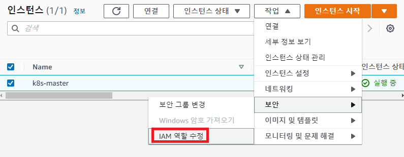
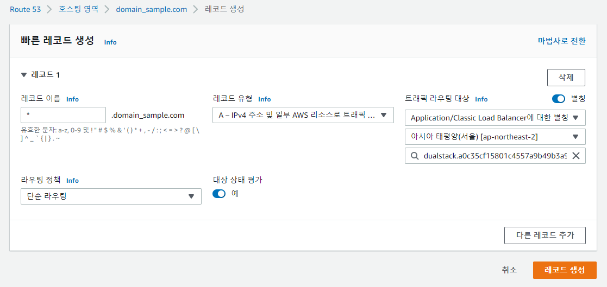

### [Index](https://github.com/PaaS-TA/Guide-eng/blob/master/README.md) > [PaaS-TA Sidecar Install](./README.md) > Sidecar

## Table of Contents

1. [문서 개요](#1)  
  1.1. [목적](#1.1)  
  1.2. [범위](#1.2)  
  1.3. [참고자료](#1.3)  

2. [Kubespray 사용 Kubernetes Cluster 구성](#2)  
  2.1. [Prerequisite](#2.1)  
  2.2. [AWS 설정 (AWS 환경 사용 시)](#2.2)  
    ※ [(참고) AWS IAM 설정](#2.2.1)  
  2.3. [SSH Key 생성 및 배포](#2.3)  
  2.4. [Kubespray 다운로드](#2.4)  
  2.5. [Ubuntu, Python Package 설치](#2.5)  
  2.6. [Kubespray 파일 수정](#2.6)  
  2.7. [Sidecar 설치용 Kubespray 설정 변경](#2.7)  
  　2.7.1 [AWS](#2.7.1)  
  　2.7.2 [Openstack](#2.7.2)  
  2.8. [Kuberspray를 통한 Kubernetes Cluster 구성](#2.8)  
  　2.8.1 [AWS](#2.8.1)  
  　2.8.2 [Openstack](#2.8.2)  
  2.9. [Kubernetes Cluster 사용 설정 & 설치 확인](#2.9)  
    ※ [(참고) Kubespray 사용 Kubernetes Cluster 삭제](#2.9.1)  

3. [PaaS-TA Sidecar 설치](#3)  
  3.1. [실행파일 소개](#3.1)  
  3.2. [실행파일 다운로드](#3.2)  
  3.3. [variable 설정](#3.3)  
  3.4. [Storageclass Default 설정](#3.4)  
  3.5. [Sidecar values 생성](#3.5)  
  3.6. [Sidecar 배포 YAML 생성](#3.6)  
  3.7. [Sidecar 설치](#3.7)  
  　※ [AWS 기반 Sidecar 설치 시 LoadBalancer 도메인 연결](#3.7.1)  
  3.8. [Sidecar 로그인 및 테스트 앱 배포](#3.8)  
    ※ [(참고) Sidecar 삭제](#3.8.1)  

# <div id='1'> 1. 문서 개요
## <div id='1.1'> 1.1. 목적
본 문서는 PaaS-TA Container-Platform 단독 배포 시 사용되는 Kubespray로 Kubenetes Cluster를 구성하고 해당 환경에서 PaaS-TA Sidecar(이하 Sidecar)를 설치하기 위한 가이드를 제공하는 데 목적이 있다.

<br>

## <div id='1.2'> 1.2. 범위
본 문서는 [cf-for-k8s v5.4.2](https://github.com/cloudfoundry/cf-for-k8s/tree/v5.4.2), [paas-ta-container-platform v1.1.0](https://github.com/PaaS-TA/paas-ta-container-platform/tree/v1.1.0)을 기준으로 작성하였다.    
본 문서는 AWS, Openstack 환경에 PaaS-TA Container-Platform 단독 배포(Kubespray)를 활용하여 Kubernetes Cluster를 구성 후 Sidecar 설치 기준으로 작성하였다.  
본 문서는 IaaS, Kubernetes에 대한 기본 이해도가 있다는 전제하에 가이드를 진행하였다.  

<br>


## <div id='1.3'> 1.3. 참고자료
PaaS-TA 컨테이너 플랫폼 : [https://github.com/PaaS-TA/paas-ta-container-platform](https://github.com/PaaS-TA/paas-ta-container-platform)  
Kubespray : [https://kubespray.io](https://kubespray.io)  
Kubespray github : [https://github.com/kubernetes-sigs/kubespray](https://github.com/kubernetes-sigs/kubespray)  
cf-for-k8s github : [https://github.com/cloudfoundry/cf-for-k8s](https://github.com/cloudfoundry/cf-for-k8s)  
cf-for-k8s Document : [https://cf-for-k8s.io/docs/](https://cf-for-k8s.io/docs/)  

<br>

# <div id='2'> 2. Kubespray 사용 Kubernetes Cluster 구성
기본적인 Kubernetes Cluster 구성방법은 PaaS-TA Container Platform 단독 배포 설치 가이드를 따라가되 일부 옵션이나 IaaS상에서 수정할 부분이 존재한다.
본 가이드의 Kubernetes Cluster 구성은 위 링크된 단독 배포 설치 가이드를 간략하게 수정하였기 때문에 Kubernetes Cluster 구성에 대한 상세 설명은 링크된 단독 배포 설치 가이드를 참고한다.

<br>

## <div id='2.1'> 2.1. Prerequisite
Kubernetes Cluster 구성을 위한 주요 소프트웨어 및 패키지 Version 정보는 PaaS-TA Container Platform 단독 배포 설치 가이드에서 확인 가능하다.  
추가로 cf-for-k8s 공식 문서에서는 Kubernetes Cluster 요구 조건을 다음과 같이 권고하고 있다.
- Kubernetes version : 1.19 ~ 1.22
- 최소 5 노드
- 노드 당 최소 4 CPU, 15GB Memory
- Network Policies를 지원하는 CNI Plugin 보유
- LoadBalancer Service 지원
- Default StorageClass 지정
- OCI 호환 레지스트리 제공 (e.g. [Docker Hub](https://hub.docker.com/), [Google container registry](https://cloud.google.com/container-registry),  [Azure container registry](https://hub.docker.com/), [Harbor](https://goharbor.io/), etc....)  
  본 가이드는 Docker Hub 기준으로 가이드가 진행된다. (계정가입 필요)

<br>

## <div id='2.2'> 2.2. AWS 설정 (AWS 환경 사용 시)
AWS에 Sidecar용도의 Kubernetes Cluster를 구성 할 경우 LoadBalancer나 Storage의 사용을 위하여 Cluster를 구성하는 인스턴스에 IAM 권한이 필요하다.
- IAM 역할을 생성하고 다음 정책을 추가한 뒤, 인스턴스 생성 시 적용한다. (IAM 설정에 관한 보충설명을 확인할 경우 하단의 AWS IAM 설정을 참고한다.)
```
# iam_policy.json

{
    "Version": "2012-10-17",
    "Statement": [
        {
            "Effect": "Allow",
            "Action": [
                "ec2:*"
            ],
            "Resource": [
                "*"
            ]
        },
        {
            "Effect": "Allow",
            "Action": [
                "elasticloadbalancing:*"
            ],
            "Resource": [
                "*"
            ]
        },
        {
            "Effect": "Allow",
            "Action": [
                "route53:*"
            ],
            "Resource": [
                "*"
            ]
        },
        {
            "Effect": "Allow",
            "Action": "s3:*",
            "Resource": [
                "arn:aws:s3:::kubernetes-*"
            ]
        },
        {
            "Effect": "Allow",
            "Action": [
                "ecr:GetAuthorizationToken",
                "ecr:BatchCheckLayerAvailability",
                "ecr:GetDownloadUrlForLayer",
                "ecr:GetRepositoryPolicy",
                "ecr:DescribeRepositories",
                "ecr:ListImages",
                "ecr:BatchGetImage"
            ],
            "Resource": "*"
        }
    ]
}
```

- 클러스터를 구성할 **인스턴스**와 사용되는 **서브넷**의 태그에 다음과 같은 태그를 추가한다.
```
key = kubernetes.io/cluster/{cluster_name}
value = member
```


<br>

### <div id='2.2.1'> ※ (참고) AWS IAM 설정
AWS IAM 설정 방법을 기술하였다.  

- AWS IAM 메뉴 - 역할 메뉴에서 역할 만들기을 선택한다.  

  
- 역할 만들기를 진행하여 정책 생성을 선택한다.  

  
- JSON을 선택하여 상단의 iam_policy.json를 붙여넣고 진행한다.  

  
- 정책을 생성 후 역할 만들기로 돌아가 생성한 정책을 선택한다.  

  
- 이름을 정하고 역할 만들기를 완료한다.  

  
- EC2 인스턴스를 구성시 IAM 역할에 만들었던 역할을 선택한다.  

  
- 만약 인스턴스를 구성 완료했는데 IAM을 설정 안했다면, 인스턴스 - 작업 - 보안 - IAM 역할 수정을 선택하여 만들었던 역할을 선택후 인스턴스를 재 부팅한다.  

  
<br>
  
## <div id='2.3'> 2.3. SSH Key 생성 및 배포
SSH Key 생성 및 배포 이후의 모든 설치과정은 Master Node에서 진행한다.

- Master Node에 접속하여 RSA 공개키를 생성한다.
```
$ ssh-keygen -t rsa
Generating public/private rsa key pair.
Enter file in which to save the key (/home/ubuntu/.ssh/id_rsa): [엔터키 입력]
Enter passphrase (empty for no passphrase): [엔터키 입력]
Enter same passphrase again: [엔터키 입력]
Your identification has been saved in /home/ubuntu/.ssh/id_rsa.
Your public key has been saved in /home/ubuntu/.ssh/id_rsa.pub.
The key fingerprint is:
SHA256:pIG4/G309Dof305mWjdNz1OORx9nQgQ3b8yUP5DzC3w ubuntu@paasta-cp-master
The key's randomart image is:
+---[RSA 2048]----+
|            ..= o|
|   . .       * B |
|  . . . .   . = *|
| . .   +     + E.|
|  o   o S     +.O|
|   . o o .     XB|
|    . o . o   *oO|
|     .  .. o B oo|
|        .o. o.o  |
+----[SHA256]-----+
```

- 사용할 Master, Worker Node에 공개키를 복사한다.
```
## 출력된 공개키 복사

$ cat ~/.ssh/id_rsa.pub
ssh-rsa AAAAB3NzaC1yc2EAAAADAQABAAABAQC5QrbqzV6g4iZT4iR1u+EKKVQGqBy4DbGqH7/PVfmAYEo3CcFGhRhzLcVz3rKb+C25mOne+MaQGynZFpZk4muEAUdkpieoo+B6r2eJHjBLopn5quWJ561H7EZb/GlfC5ThjHFF+hTf5trF4boW1iZRvUM56KAwXiYosLLRBXeNlub4SKfApe8ojQh4RRzFBZP/wNbOKr+Fo6g4RQCWrr5xQCZMK3ugBzTHM+zh9Ra7tG0oCySRcFTAXXoyXnJm+PFhdR6jbkerDlUYP9RD/87p/YKS1wSXExpBkEglpbTUPMCj+t1kXXEJ68JkMrVMpeznuuopgjHYWWD2FgjFFNkp ubuntu@paasta-cp-master
```

- 사용할 Master, Worker Node의 authorized_keys 파일 본문의 마지막 부분(기존 본문 내용 아래 추가)에 공개키를 복사한다.
```
$ vi ~/.ssh/authorized_keys

ex)
ssh-rsa AAAAB3NzaC1yc2EAAAADAQABAAABAQDRueywSiuwyfmCSecHu7iwyi3xYS1xigAnhR/RMg/Ws3yOuwbKfeDFUprQR24BoMaD360uyuRaPpfqSL3LS9oRFrj0BSaQfmLcMM1+dWv+NbH/vvq7QWhIszVCLzwTqlHrhgNsh0+EMhqc15KEo5kHm7d7vLc0fB5tZkmovsUFzp01Ceo9+Qye6+j+UM6ssxdTmatoMP3ZZKZzUPF0EZwTcGG6+8rVK2G8GhTqwGLj9E+As3GB1YdOvr/fsTAi2PoxxFsypNR4NX8ZTDvRdAUzIxz8wv2VV4mADStSjFpE7HWrzr4tZUjvvVFptU4LbyON9YY4brMzjxA7kTuf/e3j Generated-by-Nova
ssh-rsa AAAAB3NzaC1yc2EAAAADAQABAAABAQC5QrbqzV6g4iZT4iR1u+EKKVQGqBy4DbGqH7/PVfmAYEo3CcFGhRhzLcVz3rKb+C25mOne+MaQGynZFpZk4muEAUdkpieoo+B6r2eJHjBLopn5quWJ561H7EZb/GlfC5ThjHFF+hTf5trF4boW1iZRvUM56KAwXiYosLLRBXeNlub4SKfApe8ojQh4RRzFBZP/wNbOKr+Fo6g4RQCWrr5xQCZMK3ugBzTHM+zh9Ra7tG0oCySRcFTAXXoyXnJm+PFhdR6jbkerDlUYP9RD/87p/YKS1wSXExpBkEglpbTUPMCj+t1kXXEJ68JkMrVMpeznuuopgjHYWWD2FgjFFNkp ubuntu@paasta-cp-master
```
<br>

## <div id='2.4'> 2.4. Kubespray 다운로드
- git clone 명령을 통해 다음 경로에서 Kubespray 다운로드를 진행한다. 본 설치 가이드에서의 paas-ta-container-platform의 버전은 v1.1.0이며 Kubespray 버전은 v2.16.0 이다.
```
$ git clone https://github.com/PaaS-TA/paas-ta-container-platform-deployment.git -b v1.1.0
```

<br>

## <div id='2.5'> 2.5. Ubuntu, Python Package 설치
Kubespray 설치에 필요한 Ansible, Jinja 등 Python Package 설치를 진행한다.

- apt-get update를 진행한다.
```
$ sudo apt-get update
```

- python3-pip Package를 설치한다.
```
$ sudo apt-get install -y python3-pip
```

- Kubespray 설치경로 이동, pip를 이용하여 Kubespray 설치에 필요한 Python Package 설치를 진행한다.
```
## AWS 환경 설치 시

$ cd paas-ta-container-platform-deployment/standalone/aws
```

```
## Openstack 환경 설치 시

$ cd paas-ta-container-platform-deployment/standalone/openstack
```

```
$ sudo pip3 install -r requirements.txt
```

<br>

## <div id='2.6'> 2.6. Kubespray 파일 수정

- mycluster 디렉토리의 inventory.ini 파일을 설정한다.
```
$ vi inventory/mycluster/inventory.ini
```

```
## {MASTER_HOST_NAME}, {WORKER_HOST_NAME} : 실제 Master, Worker Node hostname
ex) AWS 사용 시
$ curl http://169.254.169.254/latest/meta-data/hostname
ip-10-0-0-55.ap-northeast-2.compute.internal

ex) Openstack 사용 시
$ hostname
paasta-cp-master
```

```
## {MASTER_NODE_IP}, {WORKER_NODE_IP} : Master, Worker Node Private IP

ex)
$ ifconfig
...
```

```
[all]
{MASTER_HOST_NAME} ansible_host={MASTER_NODE_IP} ip={MASTER_NODE_IP} etcd_member_name=etcd1
{WORKER_HOST_NAME1} ansible_host={WORKER_NODE_IP1} ip={WORKER_NODE_IP1}      # 사용할 WORKER_NODE 개수(1개 이상)에 따라 작성
{WORKER_HOST_NAME2} ansible_host={WORKER_NODE_IP2} ip={WORKER_NODE_IP2}
{WORKER_HOST_NAME3} ansible_host={WORKER_NODE_IP3} ip={WORKER_NODE_IP3}

[kube_control_plane]
{MASTER_HOST_NAME}

[etcd]
{MASTER_HOST_NAME}

[kube_node]
{WORKER_HOST_NAME1}           # 사용할 WORKER_NODE 개수(1개 이상)에 따라 작성
{WORKER_HOST_NAME2}
{WORKER_HOST_NAME3}

[calico_rr]

[k8s_cluster:children]
kube_control_plane
kube_node
calico_rr
```

```
ex) AWS
ip-10-0-0-55.ap-northeast-2.compute.internal  ansible_host=10.0.0.55 ip=10.0.0.55 etcd_member_name=etcd1
ip-10-0-0-66.ap-northeast-2.compute.internal  ansible_host=10.0.0.66 ip=10.0.0.66
...
[kube_control_plane]
ip-10-0-0-55.ap-northeast-2.compute.internal

ex) Openstack
paasta-cp-master  ansible_host=10.x.x.x ip=10.x.x.x etcd_member_name=etcd1
paasta-cp-worker-1  ansible_host=10.x.x.x ip=10.x.x.x
...
[kube_control_plane]
paasta-cp-master
...
```

- Metrics-server 를 배포할 Master Node의 HostName 정보를 추가한다.

```
$ vi roles/kubernetes-apps/metrics_server/defaults/main.yml
```

```
...
master_node_hostname: {MASTER_NODE_HOSTNAME}
````

<br>

## <div id='2.7'> 2.7. Sidecar 설치용 Kubespray 설정 변경

- ingress_nginx_enabled 를 비활성화 한다. (AWS, Openstack 공통)
```
$ vi inventory/mycluster/group_vars/k8s_cluster/addons.yml
...
ingress_nginx_enabled: false
...
```

<br>

### <div id='2.7.1'> 2.7.1. AWS
- AWS 환경 사용 시 cloud_provider를 AWS로 설정한다.
```
$ vi inventory/mycluster/group_vars/all/all.yml
...
cloud_provider: aws
...
```

- AWS 환경 사용 시 EBS를 사용한다면 EBS에 대한 설정을 추가한다.  
```
$ vi inventory/mycluster/group_vars/all/aws.yml

### and configure the parameters below
aws_ebs_csi_enabled: true
aws_ebs_csi_enable_volume_scheduling: true
aws_ebs_csi_enable_volume_snapshot: false
aws_ebs_csi_enable_volume_resizing: false
aws_ebs_csi_controller_replicas: 1
aws_ebs_csi_plugin_image_tag: latest
#aws_ebs_csi_extra_volume_tags: "Owner=owner,Team=team,Environment=environment'
```

<br>

### <div id='2.7.2'> 2.7.2. Openstack
- Openstack 환경 사용 시 Octavia LoadBalancer를 사용한다면 Octavia에 대한 설정을 추가한다. (선택)
```
$ vi inventory/mycluster/group_vars/all/openstack.yml
...
## Values for the external OpenStack Cloud Controller
external_openstack_lbaas_network_id: "network_id"
external_openstack_lbaas_subnet_id: "subnet_id"
external_openstack_lbaas_floating_network_id: "floating_network_id"
external_openstack_lbaas_floating_subnet_id: "subnet_id"
external_openstack_lbaas_method: "ROUND_ROBIN"
external_openstack_lbaas_provider: "octavia"
external_openstack_lbaas_create_monitor: false
external_openstack_lbaas_monitor_delay: "1m"
external_openstack_lbaas_monitor_timeout: "30s"
external_openstack_lbaas_monitor_max_retries: "3"
external_openstack_lbaas_manage_security_groups: false
external_openstack_lbaas_internal_lb: false
...
```
<br>

## <div id='2.8'> 2.8. Kuberspray를 통한 Kubernetes Cluster 구성
### <div id='2.8.1'> 2.8.1. AWS

- AWS 환경 사용 시 다음 명령어를 통해 Cluster 구성을 진행한다.
```
$ ansible-playbook -i ./inventory/mycluster/inventory.ini ./cluster.yml -e ansible_user=$(whoami) -b --become-user=root --flush-cache
```

<br>

### <div id='2.8.2'> 2.8.2. Openstack
Openstack 환경 사용 시 기존 Container-Platform 단독 배포 설치 가이드와 동일하게 진행한다.
- 인벤토리 빌더로 Ansible 인벤토리 파일을 업데이트한다.
```
## {MASTER_NODE_IP}, {WORKER_NODE_IP} : Master, Worker Node Private IP
## {WORKER_NODE_IP}는 사용할 WORKER_NODE 개수(1개 이상)에 따라 작성

$ declare -a IPS=({MASTER_NODE_IP} {WORKER_NODE_IP1} {WORKER_NODE_IP2} {WORKER_NODE_IP3})

ex)
declare -a IPS=(10.x.x.x 10.x.x.x 10.x.x.x 10.x.x.x)
```

```
## ${IPS[@]}는 변수가 아니라 명령어의 일부분이므로 주의

$ CONFIG_FILE=inventory/mycluster/hosts.yaml python3 contrib/inventory_builder/inventory.py ${IPS[@]}
```
- Openstack 환경에 설치 시 추가적인 환경변수 설정이 필요하며 설정 파일을 다운로드 받아 자동으로 환경변수 등록이 가능하다.
```
## Openstack UI 로그인 > 프로젝트 선택 > API 액세스 메뉴 선택 > OpenStack RC File 다운로드 클릭
## 스크립트 파일 실행 후 Openstack 계정 패스워드 입력

$ source {OPENSTACK_PROJECT_NAME}-openrc.sh
Please enter your OpenStack Password for project admin as user admin: {패스워드 입력}
```

- Openstack 네트워크 인터페이스의 MTU값이 기본값 1450이 아닐 경우 CNI Plugin MTU 설정 변경이 필요하다.
```
## MTU 확인 (ex mtu 1400)

$ ifconfig
ens3: flags=4163<UP,BROADCAST,RUNNING,MULTICAST>  mtu 1400
        inet 10.100.2.226  netmask 255.255.255.0  broadcast 10.100.2.255
        inet6 fe80::f816:3eff:fe2f:a831  prefixlen 64  scopeid 0x20<link>
        ether fa:16:3e:2f:a8:31  txqueuelen 1000  (Ethernet)
        RX packets 19850  bytes 167795140 (167.7 MB)
        RX errors 0  dropped 0  overruns 0  frame 0
        TX packets 17667  bytes 1920463 (1.9 MB)
        TX errors 0  dropped 0 overruns 0  carrier 0  collisions 0
...
```

```
$ vi inventory/mycluster/group_vars/k8s_cluster/k8s-net-calico.yml
```

```
...
calico_mtu: 1400
...
```

- Ansible playbook으로 Kubespray 배포를 진행한다. playbook은 root로 실행하도록 옵션을 지정한다. (--become-user=root)
```
$ ansible-playbook -i inventory/mycluster/hosts.yaml  --become --become-user=root cluster.yml
```
<br>

### <div id='2.9'> 2.9. Kubernetes Cluster 사용 설정 & 설치 확인

- Kubespray로 Kubernetes Cluster 구성 완료 후 Cluster 사용을 위하여 다음 과정을 실행한다.
```
$ mkdir -p $HOME/.kube
$ sudo cp -i /etc/kubernetes/admin.conf $HOME/.kube/config
$ sudo chown $(id -u):$(id -g) $HOME/.kube/config
```

- 설치가 정상적으로 되었는지 node와 pod를 확인한다.
```
$ kubectl get nodes
NAME                 STATUS   ROLES                  AGE   VERSION
paasta-cp-master     Ready    control-plane,master   12m   v1.20.5
paasta-cp-worker-1   Ready    <none>                 10m   v1.20.5
paasta-cp-worker-2   Ready    <none>                 10m   v1.20.5
paasta-cp-worker-3   Ready    <none>                 10m   v1.20.5

$ kubectl get pods -n kube-system
NAME                                          READY   STATUS    RESTARTS   AGE
calico-kube-controllers-7c5b64bf96-xwdgn      1/1     Running   0          8m52s
calico-node-d8sg6                             1/1     Running   0          9m22s
calico-node-kfvjx                             1/1     Running   0          10m
calico-node-khwdz                             1/1     Running   0          10m
calico-node-nc58v                             1/1     Running   0          10m
coredns-657959df74-td5c2                      1/1     Running   0          8m15s
coredns-657959df74-ztnjj                      1/1     Running   0          8m7s
csi-cinder-controllerplugin-99c9dd87b-hz62k   5/5     Running   0          7m42s
csi-cinder-nodeplugin-jjkg5                   2/2     Running   0          7m41s
csi-cinder-nodeplugin-njdrc                   2/2     Running   0          7m41s
csi-cinder-nodeplugin-sb9vg                   2/2     Running   0          7m41s
csi-cinder-nodeplugin-t5fxh                   2/2     Running   0          7m41s
dns-autoscaler-b5c786945-rhlkd                1/1     Running   0          8m9s
kube-apiserver-paasta-cp-master               1/1     Running   0          12m
kube-controller-manager-paasta-cp-master      1/1     Running   1          12m
kube-proxy-dj5c8                              1/1     Running   0          10m
kube-proxy-kkvhk                              1/1     Running   0          10m
kube-proxy-nfttc                              1/1     Running   0          10m
kube-proxy-znfgk                              1/1     Running   0          10m
kube-scheduler-paasta-cp-master               1/1     Running   1          12m
metrics-server-5cd75b7749-xcrps               2/2     Running   0          7m57s
nginx-proxy-paasta-cp-worker-1                1/1     Running   0          10m
nginx-proxy-paasta-cp-worker-2                1/1     Running   0          10m
nginx-proxy-paasta-cp-worker-3                1/1     Running   0          10m
nodelocaldns-556gb                            1/1     Running   0          8m8s
nodelocaldns-8dpnt                            1/1     Running   0          8m8s
nodelocaldns-pvl6z                            1/1     Running   0          8m8s
nodelocaldns-x7grn                            1/1     Running   0          8m8s
openstack-cloud-controller-manager-mct28      1/1     Running   0          8m57s
snapshot-controller-0                         1/1     Running   0          7m33s
```


<br>

### <div id='2.9.1'> ※ (참고) Kubespray 사용 Kubernetes Cluster 삭제
Ansible playbook을 이용하여 Kubespray 삭제를 진행한다.

```
# AWS 환경 사용 시
$ ansible-playbook -i ./inventory/mycluster/inventory.ini ./reset.yml -e ansible_user=$(whoami) -b --become-user=root --flush-cache

# Openstack 환경 사용 시
$ ansible-playbook -i inventory/mycluster/hosts.yaml  --become --become-user=root reset.yml
```

<br>

# <div id='3'> 3. PaaS-TA Sidecar 설치
## <div id='3.1'> 3.1. 실행파일 소개
- Sidecar를 설치 & 활용하기 위해선 다음과 같은 실행파일이 필요하다.

| 이름   |      설명      |
|----------|-------------|
| [ytt](https://carvel.dev/ytt/) | Sidecar를 배포 시 사용 되는 YAML을 생성하는 툴 |
| [kapp](https://carvel.dev/kapp/) | Sidecar의 라이프사이클을 관리하는 툴 |
| [kubectl](https://github.com/kubernetes/kubectl) | Kubernetes Cluster를 제어하는 툴 |
| [bosh cli](https://github.com/cloudfoundry/bosh-cli) | Sidecar에서 사용될 임의의 비밀번호와 certificate를 생성하는 툴 |
| [cf cli](https://github.com/cloudfoundry/cli) (v7+) | Sidecar와 상호 작용하는 툴 |

<br>

- Sidecar를 설치 시 사용되는 스크립트는 다음과 같다.

| 이름   |      설명      | 비고 |
|----------|-------------|----|
| utils-install.sh | Sidecar 설치 & 활용 시 사용되는 툴 설치 스크립트 | ytt, kapp, bosh cli, cf cli 설치 |
| variables.yml | Sidecar 설치 시 적용하는 변수 설정 파일 ||
| 1.storageclass-config.sh | Sidecar 설치 시 사용 할 Storageclass를 default로 정의하는 스크립트 ||
| 2.generate-values.sh | Sidecar 설치 시 사용 할 비밀번호, certificate등의 설정을 갖고있는 Manifest를 생성하는 스크립트 ||
| 3.rendering-values.sh | 비밀번호, certificate등의 설정을 갖고있는 Manifest를 활용해 YAML을 생성하는 스크립트 ||
| 4.deploy-sidecar.sh | 생성된 YAML을 이용하여 Sidecar를 설치하는 스크립트 ||
| delete-sidecar.sh | Sidecar를 삭제하는 스크립트 ||
| deploy-ebs-sc.sh | EBS Storageclass를 배포하는 스크립트 | AWS EBS 사용 시 적용|
| deploy-inject-self-signed-cert.sh | 자체 서명된 인증서를 사용하는 Private 레지스트리 사용 시 POD에 CA를 삽입하는 보조 스크립트 | 자세한 가이드는 deploy-inject-self-signed-cert.sh 파일 안 설명이나 [cert-injection-webhook](https://github.com/vmware-tanzu/cert-injection-webhook) 참고 |
| delete-inject-self-signed-cert.sh | inject-self-signed-cert를 삭제하는 스크립트 |  |
| install-test.sh | 설치 후 Test App을 배포하여 확인하는 스크립트 ||

<br>

## <div id='3.2'> 3.2. 실행파일 다운로드

- git clone 명령을 통해 다음 경로에서 Sidecar 다운로드를 진행한다. 본 설치 가이드에서의 Sidecar의 버전은 beta2 버전이다.
```
$ cd $HOME
$ git clone https://github.com/PaaS-TA/sidecar-deployment.git -b beta2
$ cd sidecar-deployment/install-scripts
```

<br>

- utils-install.sh 파일을 실행하여 Sidecar 설치 시 필요한 실행 파일을 설치한다.
```
$ source utils-install.sh
```
<br>

## <div id='3.3'> 3.3. variable 설정
- variables.yml 파일을 편집하여 Sidecar 설치 시 옵션들을 설정한다.
```
$ vi variables.yml

## COMMON VARIABLE
iaas=aws                                                    # IaaS (e.g. aws or openstack)
system_domain=sidecar.com                                   # sidecar system_domain (e.g. 3.35.135.135.nip.io)
use_lb=true                                                 # (e.g. true or false)
public_ip=3.35.135.135                                      # LoadbalancerIP (PublicIP associcated with system_domain, if use openstack)
storageclass_name=ebs-sc                                    # Storage Class Name ($ kubectl get sc) (e.g. ebs-sc[use aws] || cinder-csi[use openstack])


## APP_REGISTRY VARIABLE
app_registry_kind=dockerhub                                 # Registry Kind (e.g. dockerhub or private)
app_registry_repository=repository_name                     # Repository Name
app_registry_id=registry_id                                 # Registry ID
app_registry_password=registry_password                     # Registry Password

app_registry_address=harbor00.nip.io                        # if app_registry_kind==private, fill in app_registry_address
is_self_signed_certificate=false                            # is private registry use self-signed certificate? (e.g. true or false)
app_registry_cert_path=support-files/private-repository.ca  # if is_self_signed_certificate==true --> add the contents of the private-repository.ca file
                                                            # if is_self_signed_certificate==false --> private-repository.ca is empty

## EXTERNAL BLOBSTORE VARIABLE (Option)
use_external_blobstore=false                                # (e.g. true or false)
external_blobstore_ip=192.50.50.50                          # Blobstore Address (e.g. 127.0.0.1)
external_blobstore_port=9000                                # Blobstore Port (e.g. 9000)
external_blobstore_id=admin                                 # Blobstore ID
external_blobstore_password=adminpw                         # Blobstore Password
external_blobstore_package_directory=cc-package             # Blobstore Package Directory
external_blobstore_droplet_directory=cc-droplet             # Blobstore Droplet Directory
external_blobstore_resource_directory=cc-resource           # Blobstore Resource Directory
external_blobstore_buildpack_directory=cc-buildpack         # Blobstore Buildpack Directory


## EXTERNAL DB VARIABLE (Option)
use_external_db=false                                       # (e.g. true or false)
external_db_kind=postgres                                   # External DB Kind(e.g. postgres or mysql)
external_db_ip=10.100.100.100                               # External DB IP
external_db_port=5432                                       # External DB Port
external_cc_db_id=cloud_controller                          # Cloud Controller DB ID
external_cc_db_password=cc_admin                            # Cloud Controller DB Password
external_cc_db_name=cloud_controller                        # Cloud Controller DB Name
external_uaa_db_id=uaa                                      # UAA DB ID
external_uaa_db_password=uaa_admin                          # UAA DB Password
external_uaa_db_name=uaa                                    # UAA DB Name
external_db_cert_path=support-files/db.ca                   # if DB use cert --> add the contents of the db.ca file
                                                            # if DB don't use cert --> db.ca is empty
```
- 주요 변수의 설명은 다음과 같다.

| 이름   |      설명      |
|----------|-------------|
| iaas | Cluster가 구성된 IaaS (aws, openstack) |
| system_domain | Sidecar의 도메인(LoadBalancer와 연결되는 Domain) |
| use_lb | LoadBalancer 사용 여부 (사용 안할 시 system_domain을 Cluster Worker중 하나의 PublicIP와 연결된 system_domain으로 설정) <br> (e.g. Cluster Worker Floating IP : 3.50.50.50 -> system_domain : 3.50.50.50.nip.io 혹은 연결된 도메인 설정)|
| public_ip | LoadBalancer의 IP(클라우드 공급자가 제공하는 로드밸런서가 IP를 사용할 경우 설정) <br> (e.g. Openstack의 Octavia 사용 시) |
| storageclass_name | 사용할 Storageclass (Openstack : cinder-csi, AWS : ebs-sc) |
| app_registry_kind | Registry 종류 (dockerhub, private) |
| app_registry_address | app_registry_kind가 private일 경우 Registry 주소 입력 |
| use_external_blobstore | 외부 블롭스토어(minIO)를 사용할 경우 (true, false)|
| use_external_db | 외부 데이터베이스(postgres, mysql)를 사용할 경우 (true, false) |

<br>

## <div id='3.4'> 3.4. Storageclass Default 설정
Sidecar를 설치하기 위해서는 사용 중인 Storageclass를 default 설정 할 필요가 있다.

- AWS 사용 시 EBS를 사용한다면 EBS Storageclass를 배포한다.  
```
$ source deploy-ebs-sc.sh
```
<br>

    
- 사용하려는 StorageClass를 확인한다.
```
$ kubectl get sc 
NAME               PROVISIONER       RECLAIMPOLICY   VOLUMEBINDINGMODE      ALLOWVOLUMEEXPANSION   AGE
ebs-sc             ebs.csi.aws.com   Delete          WaitForFirstConsumer   false                  1m
```
  
<br>
  
- variables.yml에 storageclass_name 입력했다면 StorageClass의 default 사용을 위해 다음 스크립트를 실행한다.
    
```
$ source 1.storageclass-config.sh
storageclass.storage.k8s.io/ebs-sc patched
```

<br>

- 사용하려는 StorageClass가 default 설정이 되었는지 확인한다.
```
$ kubectl get sc 
NAME               PROVISIONER       RECLAIMPOLICY   VOLUMEBINDINGMODE      ALLOWVOLUMEEXPANSION   AGE
ebs-sc (default)   ebs.csi.aws.com   Delete          WaitForFirstConsumer   false                  1m
```
  
<br>

## <div id='3.5'> 3.5. Sidecar values 생성
- Sidecar 설치 시 사용 할 values를 생성하는 스크립트를 실행한다.  
  (설치 중 variables.yml을 수정하였다면 2.generate-values.sh부터 재시작 한다.)
```
$ source 2.generate-values.sh
```
<br>

- Manifest 파일은 manifest/sidecar-values.yml 에 생성되며 각종 values를 확인, 수정 가능하다.   
  (사용 가능한 변수는 [링크](https://cf-for-k8s.io/docs/platform_operators/config-values/) 에서 확인한다.)

```
$ vi manifest/sidecar-values.yml

#@data/values
---
system_domain: "system_domain"
app_domains:
#@overlay/append
- "apps.system_domain"
cf_admin_password: 0pnasdfggpq58hq78vwm

blobstore:
  secret_access_key: qkw95zasdfgrhr5dg1v4

cf_db:
  admin_password: vqorcaldasdfgz4jp8h
.....
.....

app_registry:
  hostname: https://index.docker.io/v1/
  repository_prefix: "dockerhub_repository_name"
  username: "dockerhub_id"
  password: "dockerhub_password"
```

<br>

## <div id='3.6'> 3.6. Sidecar 배포 YAML 생성

- 만들어진 sidecar-values.yml 파일을 이용하여 Sidecar를 설치할 YAML을 렌더링하여 생성한다.  
  (설치 중 sidecar-values.yml을 수정하였다면 3.rendering-values.sh부터 재시작 한다.)
```
$ source 3.rendering-values.sh
```
<br>

- YAML 파일은 manifest/sidecar-rendered.yml에 생성되며 Kubernetes를 통해 배포되는 리소스의 확인, 수정이 가능하다.

```
$ vi manifest/sidecar-rendered.yml

apiVersion: kapp.k14s.io/v1alpha1
kind: Config
metadata:
  name: kapp-version
minimumRequiredVersion: 0.33.0
---
apiVersion: kapp.k14s.io/v1alpha1
kind: Config
metadata:
  name: kapp-istio-gateway-rules
.....
```

<br>

## <div id='3.7'> 3.7. Sidecar 설치
- 생성된 YAML파일을 이용하여 Sidecar를 설치한다.
```
$ source 4.deploy-sidecar.sh

........
6:43:21AM:  L ok: waiting on pod/restart-workloads-for-istio1-11-1-pmtlv (v1) namespace: cf-workloads
6:43:25AM: ok: reconcile job/restart-workloads-for-istio1-11-1 (batch/v1) namespace: cf-workloads
6:43:25AM:  ^ Completed
6:43:25AM: ---- applying complete [296/296 done] ----
6:43:25AM: ---- waiting complete [296/296 done] ----

Succeeded

```

- Sidecar가 정상 설치되면 POD는 다음과 같이 구성된다.
```
$ kubectl get pods -A

NAMESPACE      NAME                                          READY   STATUS      RESTARTS   AGE
cf-blobstore   cf-blobstore-minio-95dc47fd6-2l85l            2/2     Running     0          2h
cf-db          cf-db-postgresql-0                            2/2     Running     0          2h
cf-system      ccdb-migrate-5w68c                            0/2     Completed   0          2h
cf-system      cf-api-clock-7669cb48cd-mm9j6                 2/2     Running     0          2h
cf-system      cf-api-controllers-558968745b-znt27           3/3     Running     0          2h
cf-system      cf-api-deployment-updater-8957f4dd6-x5dd2     2/2     Running     0          2h
cf-system      cf-api-server-794b67c6b5-wmtfc                6/6     Running     0          2h
cf-system      cf-api-worker-7d89858dfd-8qts7                3/3     Running     0          2h
cf-system      eirini-api-74b7987c55-dr96j                   2/2     Running     0          2h
cf-system      eirini-app-migration-qn9lp                    0/1     Completed   0          2h
cf-system      eirini-event-reporter-6998bfd5f6-nrwhl        2/2     Running     0          2h
cf-system      eirini-event-reporter-6998bfd5f6-qhzvf        2/2     Running     0          2h
cf-system      eirini-task-reporter-7996779cfb-824p5         2/2     Running     0          2h
cf-system      eirini-task-reporter-7996779cfb-8fmpf         2/2     Running     0          2h
cf-system      fluentd-4qsd5                                 2/2     Running     0          2h
cf-system      fluentd-5gxbl                                 2/2     Running     0          2h
cf-system      fluentd-wlv2s                                 2/2     Running     0          2h
cf-system      instance-index-env-injector-d964c475f-wdmh7   1/1     Running     0          2h
cf-system      log-cache-backend-bcbc5cb8d-shqmq             3/3     Running     0          2h
cf-system      log-cache-frontend-78985f587f-j68fn           3/3     Running     0          2h
cf-system      metric-proxy-5fdb694769-4q445                 2/2     Running     0          2h
cf-system      routecontroller-6d666b46fd-wb6cq              2/2     Running     0          2h
cf-system      uaa-66c4b86985-fx6m9                          3/3     Running     0          2h
cf-workloads   restart-workloads-for-istio1-11-1-pmtlv       0/1     Completed   0          2h
istio-system   istio-ingressgateway-46tx9                    2/2     Running     0          2h
istio-system   istio-ingressgateway-kk89r                    2/2     Running     0          2h
istio-system   istio-ingressgateway-zml5q                    2/2     Running     0          2h
istio-system   istiod-56c7f5bc65-mbmtt                       1/1     Running     0          2h
istio-system   istiod-56c7f5bc65-qrxc6                       1/1     Running     0          2h
kpack          kpack-controller-966c8d5fb-2lqmn              2/2     Running     0          2h
kpack          kpack-webhook-7b57486ddf-zwfnx                2/2     Running     0          2h
.....
```

<br>

### <div id='3.7.1'> ※ AWS 기반 Sidecar 설치 시 LoadBalancer 도메인 연결
AWS의 LoadBalancer를 사용할 경우 Route53을 이용한 도메인의 연결이 필요하다.
- AWS LoadBalancer 이름 확인

```
$ kubectl get svc -n istio-system istio-ingressgateway
NAME                   TYPE           CLUSTER-IP      EXTERNAL-IP                                                                    PORT(S)                                                      AGE
istio-ingressgateway   LoadBalancer   10.233.28.216   a0c35cf15801c4557a9b49b3a97f86ef-1468743017.ap-northeast-2.elb.amazonaws.com   15021:32733/TCP,80:30412/TCP,443:31913/TCP,15443:31820/TCP   2h
```

- Route53에서 호스팅 영역을 생성한 뒤 라우팅 대상에 LoadBalancer 이름(EXTERNAL-IP)를 입력하고 레코드를 생성한다.



<br>

## <div id='3.8'> 3.8. Sidecar 로그인 및 테스트 앱 배포
- 테스트 앱을 배포하여 앱이 정상 배포되는지 확인한다.
```
# 배포 자동 테스트
$ source install-test.sh
.......
Waiting for app test-node-app to start...

Instances starting...
Instances starting...

name:                test-node-app
requested state:     started
isolation segment:   placeholder
routes:              test-node-app.apps.system.domain
last uploaded:       Thu 30 Sep 07:04:54 UTC 2021
stack:               
buildpacks:          
isolation segment:   placeholder

type:            web
sidecars:        
instances:       1/1
memory usage:    1024M
start command:   node server.js
  state     since                  cpu    memory   disk     details
#0   running   2021-09-30T07:06:01Z   0.0%   0 of 0   0 of 0   
==============================
check output 'Hello World'
Hello World
==============================


# 배포 수동 테스트
$ cf login -a api.$(grep system_domain ./manifest/sidecar-values.yml | cut -d" " -f2 | sed -e 's/\"//g') --skip-ssl-validation -u admin -p "$(grep cf_admin_password ./manifest/sidecar-values.yml | cut -d" " -f2)"

Authenticating...
OK

Targeted org system.

API endpoint:   https://api.<system_domain>
API version:    3.104.0
user:           admin
org:            system
space:          No space targeted, use 'cf target -s SPACE'

  

$ cf create-space test-space
Creating space test-space in org system as admin...
OK

Assigning role SpaceManager to user admin in org system / space test-space as admin...
OK

Assigning role SpaceDeveloper to user admin in org system / space test-space as admin...
OK

TIP: Use 'cf target -o "system" -s "test-space"' to target new space


$ cf target -s test-space
API endpoint:   https://api.<system_domain>
API version:    3.104.0
user:           admin
org:            system
space:          test-space


$ cf push -p ../tests/smoke/assets/test-node-app/ test-node-app
Pushing app test-node-app to org system / space test-space as admin...
Packaging files to upload...
Uploading files...
 558 B / 558 B [============================================================] 100.00% 1s

Waiting for API to complete processing files...
.......
.......
Build successful

Waiting for app test-node-app to start...

Instances starting...
Instances starting...

name:                test-node-app
requested state:     started
isolation segment:   placeholder
routes:              test-node-app.apps.system.domain
last uploaded:       Thu 30 Sep 07:04:54 UTC 2021
stack:               
buildpacks:          
isolation segment:   placeholder

type:            web
sidecars:        
instances:       1/1
memory usage:    1024M
start command:   node server.js
  state     since                  cpu    memory   disk     details
#0   running   2021-09-30T07:06:01Z   0.0%   0 of 0   0 of 0   


$ curl -k https://test-node-app.apps.system.domain
Hello World

```

<br>
  
### <div id='3.8.1'> ※ (참고) Sidecar 삭제
```
$ source delete-sidecar.sh
```

<br>

  
### [Index](https://github.com/PaaS-TA/Guide-eng/blob/master/README.md) > [PaaS-TA Sidecar Install](./README.md) > Sidecar
